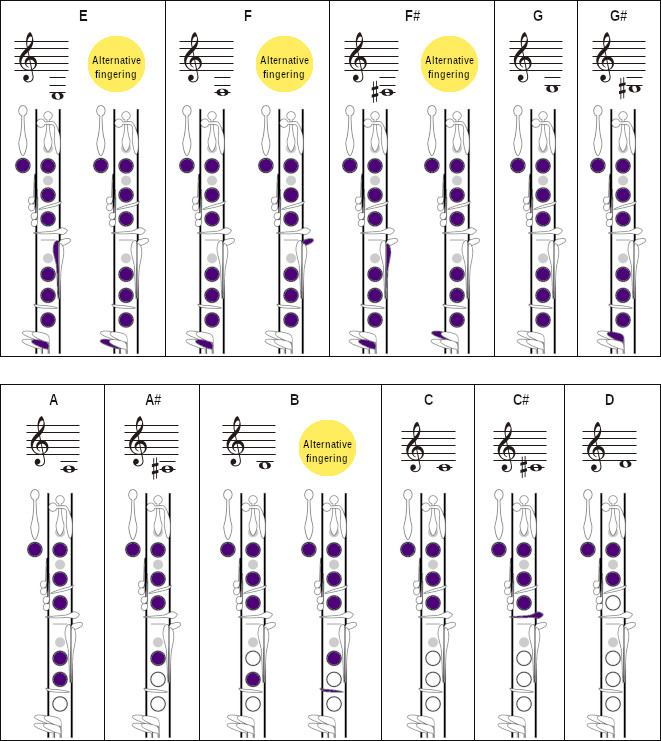

# clarinet-learning

Repo for all the note for clarinet-learning

## FAQ

- 音吹不準：舌頭的位置要往上
- 吹起來很費力，好像風速都沒辦法被轉成聲音：嘴巴要完全放鬆，用丹田出力

## Practice

- 難練地方
  - L25 ex3半音階, ex4 Bb音階
- 低音E -> A
- 低音F -> A
- 低音C -> A
- A <-> C, Bb <-> D
- 跳音
- 高音到低音氣場的轉換＃
- level2 p13 ex 1

## Equipment Upgrade

- Mouthpiece
  - Vandoren Black Diamond BD4 Bb(CM1004) clarinet mouthpiece: TWD 3200
- Ligature
  - current: D’Addario H-Ligature & Cap, Bb Clarinet, Gold-plated
  - Silverstein Works Hexa Ligature – Best Premium Clarinet Ligature USD320
- ORIGINAL CLARINET LIGATURE – GEN. 5 (165)
- Stand
- 德國 K&M, 型號：15228 豎笛架 (短但適用bell分開組裝)

## Tunes for constant practice

- p16 ex6 Prelude
- p17 ex6 Stars and Stripes Forever

## 8

- 吹得時候到底要想什麼音

## 6.25

- p24 ex5, 用唱的方式來排練表現（大小聲、快慢）要有圓滑感：漸強漸弱的表現
- p25 Musette ,第九小節, A B 點收 跳 C
- ex p26, E7b

## 6.11

- 要維持住氣的張力, 氣有力但是手跟嘴要放鬆
  - 氣的張力是, 下行的時候要撐住, 上行的時候要足夠強
- p24 ex5 垮度大的D->Eb要漸強, 反之要漸弱
- Bb的指法不能跑太偏，小指跟無名指要浮在孔上, 控制小指
- 注意全閉C5, 跟全開Bb5的時候

## 6.4

E6要撐住，C4, G5喉嚨先張好氣要快！
平常可以嘴巴拉好，練習ddd，嘴巴要放鬆舌頭才可以點的快
- Eb指法不要動太大, 記得Eb
- Exercise: p24
- p22 ex7, 指法 E3(R), F3#(L), 保持跟B4(R), C5(L)一致
- p22 E minor

## 5.21

- Bb調中Bb不好吹，要集中氣吹深, Eb不要記得吹
- Eb指法不要動太大
- ex4最後一小節, Eb5 C5 A4 F4 C4
- tip: 唸音按指但是不吹
- 一次熟練一個調

Exercise: p24

## 5.14

- 氣要從肚子出來，坐在椅子上感受尾椎出力的位置，要出的深才可以大口吸進去，不要只集中在上半身
  - 怎麼進怎麼出
- 高音用力過猛的問題，可以從吹出最小聲音
- 喉音區要往深裡吹，E3用先吹低音E2感受

Exercise:

- p22 d minor, e minor
- p24 Bb大調

## 5.7

- p21 ex1, ex2 高音C D E要hold住在一個恰到剛好的位置
  - 吹高音不要改變太大用力過猛
  - 氣深、氣快、氣集中
  - 可以從G3 F4去練
- p22 D minor, Bb C#
- 合聲音階，6-7音聽起來跨三度

不要想過高

## 4.30

Exerciese:

- p23
- p21 ex1, ex2 高音C D E要hold住在一個恰到剛好的位置，hold太高會爆掉, 太低會出不來
  - 尤其高音要微微打開喉嚨，像是打哈欠一樣，讓喉嚨的拉力跟氣的下沖形成張力
- p20 ex5, 氣要全部用完並且從深的出發，不要擠在胸腔

## 4.23

Exercise:

- p18 ex 2
- p19 ex 2 最後4小節
- P20 ex4 重輕輕，舌頭有暗回去但是不能夠太早案
- p21 ex 1 C的泛音，喉嚨要張開
- p21 ex3往下行吹力量不能放跟p20 ex5一樣

## 4.16

練習音準
盲按，盲猜，吭，確認

- 豎笛往上頂，頭不要跟著往上，不然就沒有效
- C4的泛音，喉嚨要開
- homework
- p20整業
- p20ex3 高低音銜接要吹滿，練習可以反著吹
- p20ex2 左右手交互練，左右手要俐落乾淨，有些老師喜歡最內的指法E(R), F#(L)
- P20ex4 第5小節, 三個音中間的要收，氣足但小聲
- p18ex4 四聯音跨小節，要放掉

## 4.9

- p19ex2要抓到拍點，節奏就會對，不要糾結拍長
- 找minimum effort 維持住嘴形
- p18ex4的圓滑，只點第一個音
- p18ex4喉音(D5->G4, E5->A4)要吹好前一個音必須把氣控制住
- p18ex1，每小節最後一拍嘴不能太早放，氣不能在最後一個音加強
- stacacato, 可以想像是輕輕的滴滴滴，舌頭靠裡面，用舌尖要均勻

## 4.2

- 頭不能低（一開始會有頂到的感覺
- 慢慢吹, 喉音的時候不能夠開掉（C5 E5 B4 A5 p16ex3, B4 D5 G4 D4）
- 看鏡子注意嘴型
- 下巴要拉 (錄音比較下巴有沒有拉)
- 1200目砂紙磨過後的竹片

## 3.26

- p17 ex3 不能掉
- p17 ex6 重音後半拍，要抓跨距換氣
- p18 ex 自己練習氣要平均, 不要越吹越低
練習：試試看可以先把譜背下來

## 3.19

- 記得氣不要擠，要用推
- p17 ex 4 孟德爾頌三連音
- p17 ex 6 2:2 一拍半吹起來像付點

## 3.13

感受一下下巴拉，他不是一個很需要用力的動作，只需要瘀維持住就靠，也不需要上顎或嘴型咬很緊

試試看G4 B4到底能不能順順的吹

想像一個繩子吊著後腦袋

- p16 ex2 節奏1V2V
- p17 再複習
- task: 吹長音、錄音、學習感受下巴拉

## 3.5

- 氣要維持住尤其是p15 ex1 F, A, C的上升，笛子會不由自主往下掉，哪怕只會掉一點點，音色都會有影響
- 想法是，每個段落之後要提醒自己要撐住

- p16
- ex2 先不要點
- ex4 簡寫 (bar)
- ex6 Chopin prelude 的大跨距長連音，速度慢氣要在前一個音吹滿
- tune p29 Greensleeves

## 2.27

找不到吹嘴位置的話，ㄩ從嘴唇下往上頂

Tempo: T-TT | T-TT
p29 Happy dance 跟p13第二種節奏一樣
無論如何氣還是要夠

p13 ex3,4節奏注意

## 2.5

- p13 ex1:
  - 舌頭動前半，不是靠舌根帶動
  - 嘴型必須維持住，下巴一定要拉
- p14 ex3
  - 小節要想的長，不然會太瑣碎
  - F4 到 C5的連音，要吹到夠強夠高再換音

下巴要拉嘴型沒有辦法長期維持是一件重要的事情

## 1.30

- p13 ex1: 嘴巴要放鬆, 不能夠咬緊, 氣才出的來, 要想像一下竹子孔固定而不是水管
- 氣要一直維持住
- p14 ex2,3
- tunes for clarinet

## 1.23

- P12, ex3, 可以先用4-8拍再算
- P13, ex1 三種吹法
  - 就算只有三個音心中要默默數四拍 1（2）3 4
  - 目標：每一個音要一致
  - 點音都要點在一個位置，速度要平均，氣要平均
- 每次站好，嘴拉好，深吸氣吸到肚子裡，先堵住氣再送氣，一步到位
  - 胸要打開(不要駝背)
  - 骨盆不要前傾

## 1.9.2024

- 正確的站姿，有助於身體放輕鬆，肚子好發力
- 骨盆要正，膝蓋微彎，往後坐在骨盆上，可以試試背靠牆壁，調整骨盆確保背與牆壁沒有空隙，後腦靠牆
- 弱起拍，換氣要注意, p11 ex6
- 高音(C6 D6) 的時候，豎笛可以更頂一點
- 半音上行跟指法、下行一路降C, B, Bb, A, Ab, G, Gb, F, E, Eb, D, Db, C
- 練習：時常考自己的降記號與指法
- p12

## 1.2.2024

- 眼睛平視
- 頭自然伸展
- 在吹高音喉要開共鳴在上顎下方
- 嘴巴不要咬緊，但下巴要維持張力
- 吹嘴要盡量含的深
- 吹起的深度要從肚子裡出，不能只是從胸腔出
- p11 ex2半音階指法要注意
- p10 ex6, 數拍要想到整個前三小節

## 12.19

- 下巴要拉，下唇要頂, 下唇不頂竹片會接觸面太大
- p10-ex4 音階轉換聲音要明確，可以從兩連音，一路到一整個小節
  - 音階先想音, 再想指法
- 跳音的氣要長於舌頭, 氣要一直輸出
- p10-ex1 最後兩小節 C6, D6 氣集中，細與快，舌頭短，喉嚨寬
- 吹到不行的時候就完全放空

## 12.5

- p10 ex1 氣的速度必須要夠快才能夠跳
- 跳音必須要能夠均, T-TTT, or T-TT
- 泛音可以從B3, F5, D6練
- p9 ex1 注意氣量控制, 上行不要爆掉, 下行要加氣但是不要壓
- Exercise: P8ex6, P9ex4, P10

## 11.21

跳音必須要能夠均勻、氣能夠一直延續到後面的音符，而不是條完就斷掉 p8 ex6

- 舌頭找到固定的位置，不能點太大力堵住風，要能夠放鬆

- Accent是加力的推，跳但不舌頭不點回去

- Syncopation 切分音前要吹accent, 前面不要這麼用裡 p8 ex4
- practice: p9

## 11.14

- 檢查上下節管有沒有接好，要看上管能不能固定
- p6 ex7 吹裝飾音要想高，不能用喉嚨去擠
- p8, 強調音，不是重音
- syncopation 切分音
- B, C# 都必須單手，左右手分開按，同時按會音有所差
- p7 ex4 C# -> E 無名指跟小指要同時放
- review p6 ex7 p7 ex5
- Tenudo 好像是在揉麵糰, 持續擠

## 10.31

舌頭要練習在同一個位置

點音練習 p3 ex4

- 點音的問題
- 嘴巴要足夠放鬆，肩膀身體不要蝦起來
- 想像氣要從骨盆頂出來

裝飾音練習 p3 ex7

- 裝飾音B4, C5
手跟氣分開練
像是吹口哨那樣集中

## 10.24

- 氣先預備好，舌頭壓上去，吹氣，再拿開
- p3 ex7 裝飾音要點第一個音
- p3 ex2 有兩種吹法，練習的方式可以先吹同一個音，再把音階放進來
下巴要有張力是全部肌肉都要能夠hold住
- p2 ex5 再練習

## 10.17

確保不能漏氣，從最輕的氣慢慢加，嘴型要夠放鬆才能包住
首先不要用太多力, 不要過度拉下巴（維持瘀的嘴型，下顎都不能動

- p2 ex3 第三小節G4到G3是嘴型正確的一個很好練習
- 用mf的力量送氣，下唇是撐不是頂
- C3, G4, D5的泛音是一個很好的練習

## 9.12

身體要注意不要越吹越低
不要cu起來，打開身體拉高脖子
D3, G4, G2跨度比較大要注意整個氣方向應該往下，不然會爆掉
Technic: L2, 要想好氣的深度

## 9.5

- Technic P19.20. 視譜, 看調, 想節奏, 指法
  - 進行曲, 有首尾 , 弱起拍
- Technic: p18 Scale in Variaction C and F
  - F#, G#是一個淺dip

## 8.29

挑選竹片，太厚的可以用1200的砂紙去磨
要注意的就是氣的持續性，一定要夠深，可以靠半蹲靠牆法（腰頂滿）練習棒式持續出力
換課本:
Clarient Student: Intermediate
L32 ex.5 Morris Dance A3到A4要注意喉嚨不能開掉

## 8.22

- 練習：先把氣的速度、手的熟練度抓住，最後再跟著音決定氣的深度
- 注意常常吹不動，嘴把太緊、氣沒有繼續給
- 共鳴點要抓到在鼻腔額頭的位置，喉嚨O一點

L33 Eb大調, 重點是氣一定要均勻
, 胡桃鉗要吹到高音C的就好, 再深會在其他音的時候吹爆掉
L32 ex.5 Morris Dance

## 8.15

- 左右手的都可以有兩種指法C4# B3
- 兩拍的節奏
- B4 G4# 手指位置要一致
- 氣不要被音所影響，氣要像是腳踏車一直往前，而不是核心收緊卡在那邊
- L32 ex.1,2,3,4,5
- L30 ex 5

## 8.8

- 舌頭跟下巴一開始就要到位
- 十六分音符是一定要想成舌頭黏在竹片上，然後拔開
- D6, 要脖子拉，氣要吹深
- 撥線，氣要快壓力夠大
- L31 ex.1,2,3,4,5
- Roses from the south

## 8.1

- 注意舌根要抬起，不要往後
- L30, 點音要注意到氣有到位，並且每個音確實點到
- 跳音要注意不要抱
- L30 ex5: C4的左手, Eb4轉換
- 點音要都點到，氣一開始要出來但是不能太大
- 跳音不要跳了之後把氣都放掉

melody: p16: variation o a famous theme.

- scale variation in F, 下巴要記得拉
p18: variation o a famous theme.
- scale variation in C

## 7.18

轉高音的時候，笛子不要掉，也不要壓笛子，對抗的方法就是吹高音的時候要頂
高音的時候記得要吹更深，回低音的時候不要太縮
G4,A4要hold住,不能掉音

L29 ex2 C3->G4這種要靠點音，手指斜著擠
L29 ex1 半音階

melody: p16: variation o a famous theme: Scale variationII in Key of F
p17: 大跨距

## 7.2

吹連音的時候要想ㄋㄩㄝ
F到P氣量小但是速度一致，最後沒有聲音的時候圖片還要忍是震動的

2/4拍的相通拍6/8, 4/4是12/8
L28
L27 ex7,8, 從3/4改到3/8但是速度要一致

melody: p16: variation o a famous theme.

## 6.27

吸一拍吹八拍
A氣吹的多可以減輕B嘴型的壓力=C好聲音

吐氣時肚子要頂住，不能放開
臥佛的吹氣方式：右手放在嘴上，要能夠吹出聲音

F 抓80%的力量一路到P是20%, 速度一致就是減少氣量

- L28

## 6.15

ㄋㄩㄝ（帶鼻音）
共鳴的位置要一直保持住，在鼻腔跟上顎
下行的時候要注意＃hold住
下巴拉是控制著下巴的肌肉，要鬆但是不能漏氣
中央C到高音尤其必須注意好共鳴位置，因為這邊
現在的目標就是要調好聲音

## 6.7

下巴要拉、透過看看鏡子
音准有到不代表就是正確
先固定下巴再調整舌頭
可以坐著練

簡應的時候動作小一點
ㄋㄩㄝ（帶鼻音）

- L26 repeat
- <https://youtu.be/7Dmqujf6uGE>

## 5.25

- 高音跟喉音的時候喉嚨不能掉(要撐住，不然會變低音）、感覺要被後頸吊、注意身體不能越吹越低
- 半音階吹圓滑順, 熟練，必須要能夠無腦記憶
- 力量使用mp, 嘴型一定要放輕鬆
- L26
- 難練地方
  - L25 ex3半音階, ex4 Bb音階
  - E6常常差半個音

## 5.18

- 下巴訓練3個高音，在此法不變的情況下
- C4->G5->E6
- A4->E5->D6
- 關鍵：喉嚨吞嚥的動作，下巴要拉
- 半音階的下行要特別注意
- 重音是一口氣加力吹，之後把氣收回來

## 5.11

- 魚ㄩ嘴型小力,拉也是,下巴要平，喉音高音可以聽出來差異
- 練習從低音E到G的半音階 L23 ex3
- L23, ex9, L24
- <https://youtu.be/VAwHFPb71KI>

## 5.4

半音的音階必須非常熟練(C, C#, D, D#, E, F, F#, G) L23 ex2
要嘗試練習下巴有沒有拉到
要再是一個放鬆的狀態
氣必需均勻的出來：<https://youtu.be/XkBk7Wg_KBQ>

- p14 Russian Melody, p14,15都可吹吹不難

# 4.20

- L22 ex 5, 6, 7
- p12 She'll Be Comin' Round The Mountain 低音的氣一開始就要出來
- p12 Theme from High School Cadet March: 重音可以用跳的方式強調
- p13 Fiesta
- p13 Long Long Ago
- Bb的一個半音轉換指法：C B Bb A
- 身體注意不要越吹越低
- 第一口氣就要吹到Bell

# 4.13

- L22 ex3 跳音、ex4流暢點音
放鬆笛不要往下，肩不要往上
氣一定要吹深過Bell,
音往上吹，氣往下走
跳的時候要持續送氣，送氣有點像是擠壓氣球，而不是持續越吹越漏
嘴巴不要O掉
選擇一個適當的張力維持下巴，而不是下顎的肌肉

# 4.6

- L21 ex3 跳音

要一口氣吹，千萬不能加力但是要撐住
練習方法: 連音->點音->跳音
就算是吹中央都的一口氣也要到高音都的位置
簡而言之就是氣柱的長度要一直維持著

另外一個跳音的練習方法是把一拍分成四段, 從後面點到前面：|-^ -^ -^ -^ |

# 3.30

- 下唇頂住讓音變得飽滿
- L20
- L21 跳音
- 跳音: 先吹連音，舌頭不要太大，同一口氣
- p12 Sleeping Beauty Waltz, 大三拍
- B的另外一個按法（忘記是跟哪首曲子配合）

# 3.23

- 點音staccato
舌頭放鬆
重低音往下吹
一次復制一個音
用耳朵去聽聲音到底對不對，而不要去想舌頭位置
用舌頭把氣堵住，所以沒有聲音的時候氣是被憋著的

# 3.16

Bb的左手要動作大方便自己按
跳音staccato, 點放點,但是舌頭要小

- 只能舌頭動, 下頜完全不可以動
- 發音是taa taa taa
- <https://youtu.be/mEENqe_M1_M>

# 3.9

- 練習嘴巴放鬆, 很緩慢的送氣, 氣要從肚子裡面出來, 不能夠發出聲音, 之後加快氣直到達到深度
- 維持好嘴型, E嘴型是指下巴收的情況, 舌頭往上
- 藉由按兩隻食指，確保左食指下方的鍵是按緊的
- L19
- p11 Rainbow Theme, p12 Sleeping Beauty Waltz

# 3.2

- 音要切分吹，兩個音一組，連、慢
- A <-> C, Bb <-> D
- D <-> F 手速要快
- 低音E本來就會不準（送氣正確的情況還是可以準的）
- 姿勢要注意，有時候吹一吹會往下滑，必要的話要往門牙內側頂
- L18 ex2, ex4
- p11 Theme From High School, Home Sweet Home

# 2.23

- 高音轉低音的氣住練習
- A或G -> B/C往往比下來難很多
- 先吹高音再吹低音記住氣柱的樣子
- 連貫圓滑氣要滿
嘴巴脖子都要放鬆
- 送氣的方式一樣可以反練, 先吸氣維持嘴型, 然後再送氣
- L18 ex 8
- p8 Dance,  p9 Caamptown Races

# 2.16

- G C 口要放鬆，氣深: L15 ex 6
- 記得高音一定要吹深
- 加強八度 （豎笛是12度高低音差）
- A, B, C轉換

# 2.9

- G C 口要放鬆，氣深: L15 ex 6
- F# 有特別指法: L16 ex 3
- A Bb C的指法轉換L16 ex 6
- Others L15
- L17

# 1.30

- 下巴要拉
- 手舌協調
- L15: ex 6/7/8
- L16: 自己練
- Melody: p9 Bicycle Build For Two

# 1.9

- Bb 轉 D 左手按起要果決
- D# 在C, B轉換的時候只能按左手
  - C, B都有兩種指法
- G, A 轉B, 可以先按住右手吹連音
  - 尤其要注意G, A時左手的手指位置, 要讓食指的移動盡量小, 左手要進輛往左拉
- lesson 15
- 不要聳肩

# 12.27

- 吹低的時候要氣深，想到音吹，喉嚨O
- 高音吹丟的時候吹E

# 12.22

- 高音B , A , G, D, C互換氣要連吹深想低音
- 嘴巴放鬆氣送快
- lesson
Clarinet Student
  - lesson 14
  - lession 13 ex4 Grandfather's clock, ex5 Gypsy Sweetheart, ex9 Hymn
Tunes:
  - p7 The band played on.
  - p8 Alla turca

# 12.13

找到一個固定放鬆嘴的位置
吸氣要用嘴大口吸
手指要按準，不是按緊，怎麼判定有沒有按緊就是當要很費勁吹的時候就要檢查一下走
好的練習：高音B 配各種中央音的互換
先想好再下手

# 12.6

B->G的轉換可能會造成B吹不出來, 這個時候就要先吹低音E
同時B->G這個指法也很妙, 就是左手是全按
Lesson-11 (注意ex6, ex9)

# 11.29

肚子用力、吸足氣吹到底、 這一點至關重要，嘴巴會感到酸是因為力出不足所以在幫補
Bb -> A 指尖要往下、手指確定都要按在吹孔上面
Lesson-12

# 11.15

注意指法音階lesson-10 ex7

- C -> G -> C -> A -> C -> Bb
- Bb -> E
氣要撐四小節，點音要點對
下巴的張力要維持住
舌頭的位置不能掉下來
Lesson-10
Lesson-11

# 11.8

第一個音就要吹到位，前提是把上一口氣全部吐掉
氣必須維持住，獨立於音
最高音的時候要想著把音拉/提起來
低音音階的指法要熟練（A到G)轉換
吹嘴含深

- lesson 9 ex9,10
- lesson 10 ex1-5

# 11.1

- 高音梯強弱的控制：高音本身就亮，所以不用這麼強，低音暗所以要更強
- 送氣是從肚子送，肚子全程要hold住
- 下巴要往下拉維持住張力
- 4拍強弱（強、弱、中、弱）
- lesson
  - lesson 8 ex9-10
  - lesson 9 ex1-9

# 10.25

- 氣柱要維持住+肚子持續施力，並且在低音的時候吹深，並且維持尾勁
- 維持氣柱，不要讓手的動作影響氣
- 點音，可以試豎笛角度大一點
- 泛音練習：尤其F升C，學習放鬆喉嚨（閉嘴放鬆打呵欠
- 練習漸強到下一個音
-

練習lesson 7 ex9
lesson 8 ex1-8

# 10.20

上課內容：
嘴型不能跑掉: 先用ㄌㄩㄝ再把吹嘴頂上去
氣柱要吹到底
先練圓滑的，再點音
點音的重點是舌頭往後收
得得得只能動到舌頭不能動到其他肌肉

- lesson 7: ex4~8

# 10.13

上課內容：

- 泛音
- 點舌（附點）：ㄉ--ㄉㄉㄉ or ㄉㄉㄉ--ㄉ
- 全身放鬆（嘴巴不要咬太緊，肚子用力，力量放在鎖骨，肩膀放下
- 維持氣柱的長跟深！

# 10.4

上課內容：

- 氣足氣快舌頭少, 避免吹出破音
- 泛音：透過按住後面最上的按鍵，低高音差12度，
  - 低音E直接升成B，剛好接在A上面
  - 低音E 建議兩手都要按，方便E、F轉換，要維持住吹低音的氣柱

- 不要咬太緊，不然吹不上氣
- 困難指法
- lesson 6: 6, 7
- lesson 7: 點音與連音

# 9.27

上課內容:

- 調音！（tunable app)
  - 嘴型更集中
  - 整塊舌頭往上貼(跟發E的音)
  - 調音器練習 (A, 442, +/- 15 cent)
  - 不要咬太緊，可以頂深一點
要hold住, 通常是一開始會準, 然後開始flat
Duet in lesson 6

# 9.20

上課內容:

- 共鳴位置更高E發音，舌根更上面
- 調整氣，找到好音色（想E然後舌頭盡量往上顎頂
- 第一口氣就要吹到位（往深處吹、速度快），前一小節呼吸（數1,2,3,4吸口氣)
- 學會換氣！
- E A轉換必要不靠點音一步到位, 只能動小指
- 空手先想好指法

功課：lesson-5: 尤其是ex.10
問題：

- 進度：還是要把整本課本基礎先練好、音階：轉換
- [These are the 10 best clarinet works in existence (end of debate)](https://www.classicfm.com/discover-music/instruments/clarinet/features/best-clarinet-pieces/)

# 9.15

上課內容

點舌時的ㄉㄉㄉ，是在音一開始的時刻，而不是後拍，點舌跟換指要同時
空手練，想好再送氣，想好再按
練附點訓練舌頭
高音拉只動一食指而不是整隻手，豎笛的支點在嘴跟手

功課：
lesson-3. exer4: 練附點訓練舌頭, 不要放在竹片上太久
lesson-4: exer5: E <-> A 轉換

練習心得：

- 追求的是要一次到位！吹速一上來就有準音，並且很平穩維持
- 可以把手指貼在上顎，試著用舌頭去頂
- 送氣千萬不要用力

問題：

- 手指沒有按滿會發出尖銳的高音，低音do尤其嚴重
- 點音的時候，有時候會發生舌頭伸出來會有壓迫到空氣導致小高音，或是聽起來沙沙的

# 8.30

- 換綁嘴
- 嘴形不能O掉, 一O舌根就會下壓聲音就不會好聽

- 問題：下巴酸是正常的嗎？
我常常會因為要確保在點音的時候，嘴行不掉跑掉、常常會下巴要的很緊
- 不正常：訓練正常發力！
- 單音重複吹常常會爆音，通常是什麼原因？是竹片太濕、嘴形跑掉

- 練習：
- [lesson 3] la 食指向上扳, 力求能快速在so la之間切換
- [lesson 2] fa -> re 轉換
- 空吹不要發出聲音，加速氣一次到位
- 舌根靠上，氣吹直並且一次到位，感受好聲音（舌根在上vs舌根在下）

# 8.23

- 組裝注意：竹片在吹嘴下面一點點，還可以靠上面
- 兩隻手按緊確認有連動
- 好的聲音用下頷部分共振（吹嘴向後延伸處），避免用喉嚨共振
- 點音 （在那一拍結束的時候要把舌頭果決放上去）
- 無笛練習，用手遮住嘴，嘴不能停止吹氣，手放開的時候，有一個壓力卸掉的聲音。
- 先吹後擋、先擋後吹
吹氣想T
舌尖輕點竹片
練習舌頭控制可以發：ㄉ ㄩ
氣不能停

第一個音一定是要點（先把舌頭放在上面）
手指要低，越低越好，方面移動

- 練習：[課本lesson 2](doc/student-level-1/lesson2.jpeg)
- 從慢點音, 到快點音, 吹->點

# 8.16

樂器來跟嘴，不是嘴追樂器
下唇在吹的時候要盡量收
所有的發聲出力就跟吹口哨一樣，嘴型在前半，發力應該都是一致，除了嘴形其他都是放鬆的狀態，不應該運用到喉部
想那個音的高低

口哨嘴形->笛嘴幾乎平行嘴唇貼上去->由下往上頂到門牙
照鏡子檢查下唇有沒有跑掉

練習：吹笛頭，嘗試控制吹出兩種不同的音高

心得：一想用力就是不對的，必須立刻放掉

# Question

- 吹C的時候阻力很大, 有時候可以透過喬角度吹出來, 但是聲音就很高

# Step

# Master

Artie Shaw

# Equipment

Vandoren 豎笛/黑管 竹片 V5藍盒 2號半 2.5 竹片（10片/盒）Clarinet 單簧管【型號：CR1025】 - 小新樂器館 | 樂器購物官網,小新吉他館,創立於1999年 | 大台北實體樂器行

- [5 Major Parts Of A Clarinet You Need To Know](https://phamoxmusic.com/parts-of-a-clarinet/)
